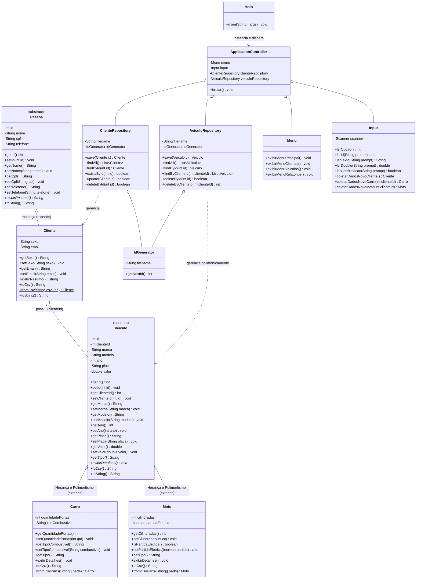
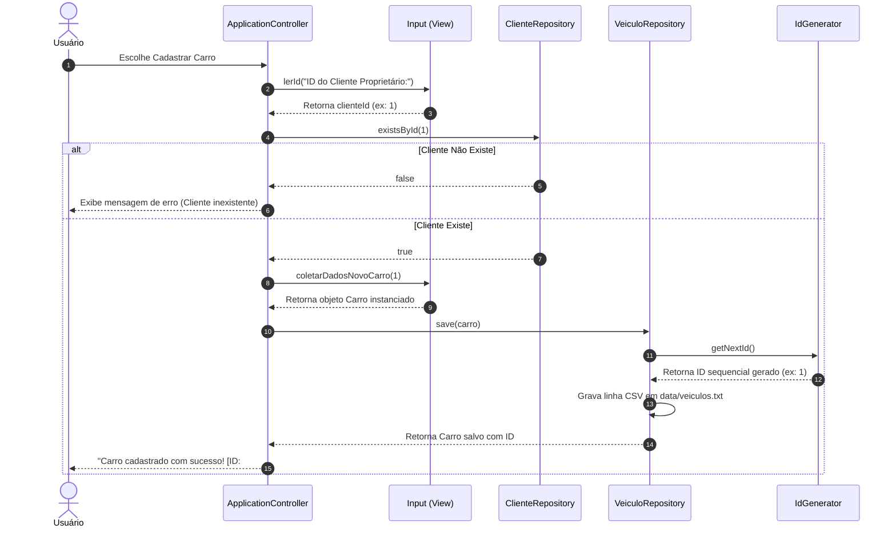

# Diagramas UML do Sistema (POO)

Este documento contém os diagramas de modelagem orientada a objetos do sistema, renderizáveis diretamente pelo GitHub via sintaxe **Mermaid**.

---

## 1. Diagrama de Classes Completo

---

## 2. Diagrama de Sequência: Cadastro de Veículo com Validação de Integridade

O diagrama abaixo ilustra a interação entre as camadas para evitar o cadastro de veículos órfãos:

---

## 3. Explicação dos Conceitos Aplicados

1. **Encapsulamento:** Todos os atributos em todas as classes de modelo são `private`. O acesso e modificação ocorrem unicamente por métodos públicos com validação de dados.
2. **Herança:** A classe `Cliente` herda atributos e comportamentos de `Pessoa` via palavra-chave `extends`. As classes `Carro` e `Moto` herdam de `Veiculo`.
3. **Abstração:** `Pessoa` e `Veiculo` são declaradas com `abstract`, impedindo instanciação direta incompleta e definindo contratos via métodos abstratos.
4. **Polimorfismo:** `Carro` e `Moto` sobrescrevem (`@Override`) o método `exibirDetalhes()` e `getTipo()`. A coleção `List<Veiculo>` permite iterar sobre veículos heterogêneos chamando o comportamento específico de cada subclasse em tempo de execução.
