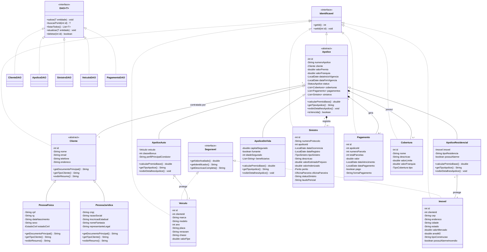
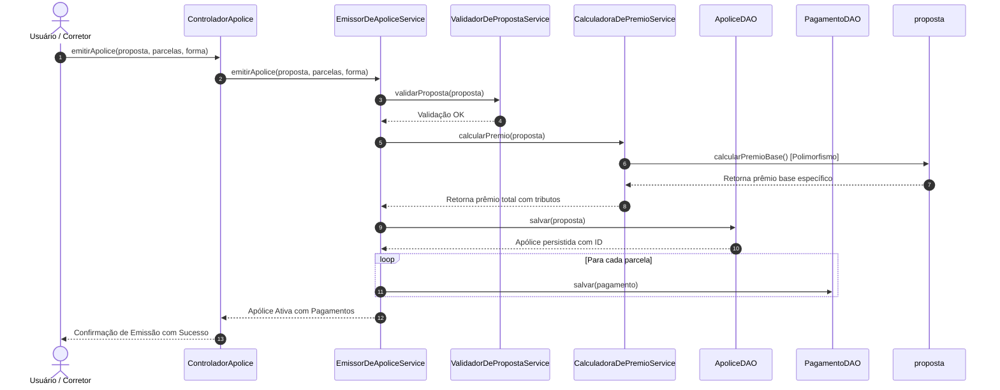

# Diagramas UML do Sistema de Seguros e Clientes (POO)

Este documento contém os diagramas de modelagem orientada a objetos atualizados do sistema, renderizáveis diretamente pelo GitHub via sintaxe **Mermaid**.

---

## 1. Diagrama de Classes Completo

---

## 2. Diagrama de Sequência: Emissão de Apólice com Cálculo Atuarial

