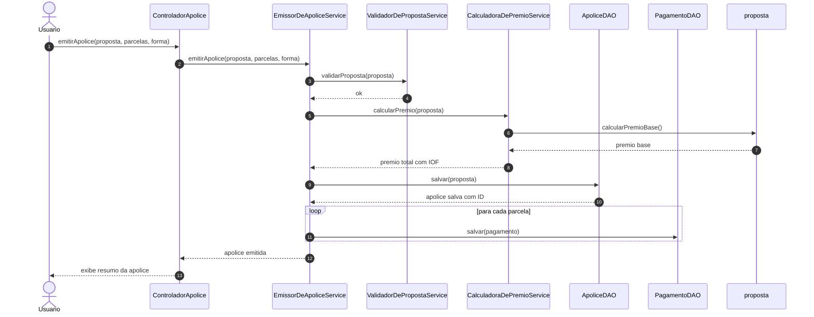

# Diagramas UML do Projeto

Diagramas de classes e de sequência do sistema no formato Mermaid.

## 1. Diagrama de classes

```mermaid
classDiagram
    direction TB

    class Identificavel {
        <<interface>>
        +getId() int
        +setId(int id) void
    }

    class Seguravel {
        <<interface>>
        +getValorAvaliado() double
        +getIdentificador() String
        +getDescricaoCompleta() String
    }

    class DAO~T~ {
        <<interface>>
        +salvar(T entidade) void
        +buscarPorId(int id) T
        +listarTodos() List~T~
        +atualizar(T entidade) void
        +deletar(int id) boolean
    }

    class Pessoa {
        <<abstract>>
        -int id
        -String nome
        -String cpf
        -String telefone
        +exibirResumo()* String
    }

    class Perito {
        -String registroProfissional
        -String especialidade
        -String email
        +exibirResumo() String
    }

    class Cliente {
        <<abstract>>
        -int id
        -String nome
        -String email
        -String telefone
        -String endereco
        +getDocumentoPrincipal()* String
        +getTipoCliente()* String
        +exibirResumo()* String
    }

    class PessoaFisica {
        -String cpf
        -String rg
        -String dataNascimento
        -String sexo
        -EstadoCivil estadoCivil
        +getDocumentoPrincipal() String
        +getTipoCliente() String
        +exibirResumo() String
    }

    class PessoaJuridica {
        -String cnpj
        -String razaoSocial
        -String inscricaoEstadual
        -String nomeFantasia
        -String representanteLegal
        +getDocumentoPrincipal() String
        +getTipoCliente() String
        +exibirResumo() String
    }

    class Apolice {
        <<abstract>>
        -int id
        -String numeroApolice
        -Cliente cliente
        -double valorPremio
        -double valorFranquia
        -LocalDate dataInicioVigencia
        -LocalDate dataFimVigencia
        -StatusApolice status
        -List~Cobertura~ coberturas
        -List~Pagamento~ pagamentos
        -List~Sinistro~ sinistros
        +calcularPremioBase()* double
        +getTipoApolice()* String
        +exibirDetalhesApolice()* void
        +adicionarCobertura(Cobertura c) void
        +adicionarCobertura(String nome, double limite, double franquia, TipoCobertura tipo) void
        +isVencida() boolean
    }

    class ApoliceAuto {
        -Veiculo veiculo
        -int classeBonus
        -String perfilPrincipalCondutor
        +calcularPremioBase() double
        +getTipoApolice() String
        +exibirDetalhesApolice() void
    }

    class ApoliceResidencial {
        -Imovel imovel
        -String tipoResidencia
        -boolean possuiAlarme
        +calcularPremioBase() double
        +getTipoApolice() String
        +exibirDetalhesApolice() void
    }

    class ApoliceDeVida {
        -double capitalSegurado
        -boolean fumante
        -int idadeSegurado
        -List~String~ beneficiarios
        +calcularPremioBase() double
        +getTipoApolice() String
        +exibirDetalhesApolice() void
    }

    class Veiculo {
        -int id
        -int clienteId
        -String marca
        -String modelo
        -int ano
        -String placa
        -String renavam
        -String chassi
        -double valorFipe
    }

    class Imovel {
        -int id
        -int clienteId
        -String cep
        -String endereco
        -String cidade
        -String estado
        -double valorMercado
        -double areaM2
        -String tipoConstrucao
        -boolean possuiAlarmeIncendio
    }

    class Sinistro {
        -int id
        -String numeroProtocolo
        -int apoliceId
        -LocalDate dataOcorrencia
        -LocalDate dataRegistro
        -TipoSinistro tipoSinistro
        -String descricao
        -double valorEstimadoPrejuizo
        -double valorIndenizado
        -Perito perito
        -OficinaParceira oficinaParceira
        -String statusSinistro
        -String laudoPericial
    }

    class Pagamento {
        -int id
        -int apoliceId
        -int numeroParcela
        -int totalParcelas
        -double valor
        -LocalDate dataVencimento
        -LocalDate dataPagamento
        -boolean pago
        -String formaPagamento
        +registrarQuitacao() void
        +registrarQuitacao(LocalDate data) void
    }

    class Cobertura {
        -int id
        -String nome
        -String descricao
        -double valorLimite
        -double valorFranquia
        -TipoCobertura tipo
    }

    Identificavel <|.. Cliente
    Identificavel <|.. Perito
    Identificavel <|.. Apolice
    Identificavel <|.. Veiculo
    Identificavel <|.. Imovel
    Identificavel <|.. Sinistro
    Identificavel <|.. Pagamento
    Identificavel <|.. Cobertura

    Seguravel <|.. Veiculo
    Seguravel <|.. Imovel

    Pessoa <|-- Perito
    Cliente <|-- PessoaFisica
    Cliente <|-- PessoaJuridica

    Apolice <|-- ApoliceAuto
    Apolice <|-- ApoliceResidencial
    Apolice <|-- ApoliceDeVida

    Apolice "1" o-- "1" Cliente : cliente
    ApoliceAuto "1" o-- "1" Veiculo : veiculo
    ApoliceResidencial "1" o-- "1" Imovel : imovel
    Apolice "1" *-- "0..*" Cobertura : coberturas
    Apolice "1" *-- "0..*" Pagamento : pagamentos
    Apolice "1" *-- "0..*" Sinistro : sinistros
    Sinistro "0..*" o-- "0..1" Perito : perito

    DAO <|.. ClienteDAO
    DAO <|.. ApoliceDAO
    DAO <|.. SinistroDAO
    DAO <|.. VeiculoDAO
    DAO <|.. PagamentoDAO
```

## 2. Diagrama de sequência: emissão de apólice

```mermaid
sequenceDiagram
    autonumber
    actor Usuario as Usuario
    participant Ctrl as ControladorApolice
    participant Emissor as EmissorDeApoliceService
    participant Validador as ValidadorDePropostaService
    participant Calc as CalculadoraDePremioService
    participant ApDao as ApoliceDAO
    participant PagDao as PagamentoDAO

    Usuario->>Ctrl: emitirApolice(proposta, parcelas, forma)
    Ctrl->>Emissor: emitirApolice(proposta, parcelas, forma)
    Emissor->>Validador: validarProposta(proposta)
    Validador-->>Emissor: ok
    Emissor->>Calc: calcularPremio(proposta)
    Calc->>proposta: calcularPremioBase()
    proposta-->>Calc: premio base
    Calc-->>Emissor: premio total com IOF
    Emissor->>ApDao: salvar(proposta)
    ApDao-->>Emissor: apolice salva com ID
    loop para cada parcela
        Emissor->>PagDao: salvar(pagamento)
    end
    Emissor-->>Ctrl: apolice emitida
    Ctrl-->>Usuario: exibe resumo da apolice
```
